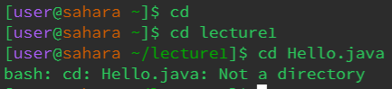
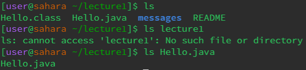
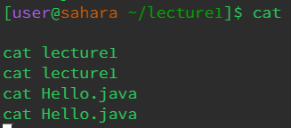

The working directory was home initially, and then it was lecture1. The third command does not work on a file. It's an error because the cd command only works on directories and Hello.java is a file.

The working directory was lecture1. The ls command lists out all the folders and files present if executed on its own without any arguments. When using ls on a file, the command will show the file itself. 

The working directory was lecture1. The cat command did not display anything. 
