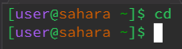
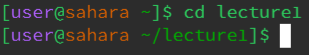
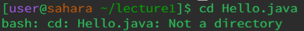
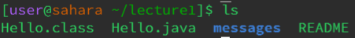
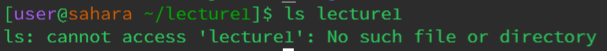
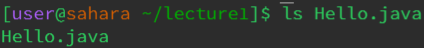
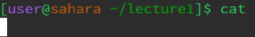
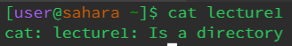
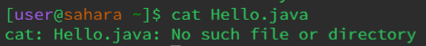

Helena Phamova - **CSE 15L Lab Report 1**

> For this command, cd takes the terminal to the home directory by default when no arguments are given.

> Working directory: home

> The output is not an error. As seen on the terminal, it is currently in the home directory.

---

> For this command, the terminal is taken to the lecture1 directory.

> Working directory: lecture1

> The output is not an error. The terminal is showing that it is in the lecture1 directory. We can use the command 'pwd' to show the current working directory as it stands for 'print working directory'.

---

> The terminal recognizes the fact that Hello.java is not a directory.

> The command outputs an error as Hello.java is a file, not a directory. In other words, cd only works with 'folders' that are so-called directories.

> Working directory: still lecture1

---

> This command lists out all the contents inside the lecture1 directory. But besides that, ls on its own without any arguments will always list out all the contents that is present in the current working directory.

> Working directory: lecture1

> The output is not an error as the contents inside lecture1 have been shown.  

---

> This command is trying to list all the contents inside lecture1.

> Working directory: lecture1

> The output is an error message. Since the working directory is lecture1, the ls command with lecture1 as the argument throws an error because the command is having trouble accessing the directory. 

---

> This command...

> Working directory:

> The output is..

---

> This command...

> Working directory:

> The output is..

---

> This command...

> Working directory:

> The output is..

---

> This command...

> Working directory:

> The output is..

