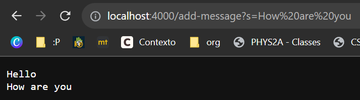

Helena Phamova - **CSE 15L Lab Report 2**

---

Hello this is my second lab report for CSE 15L!


**PART 1**

This is my code for `StringServer`

```
import java.io.IOException;
import java.net.URI;
import java.util.*;

class Handler implements URLHandler {
    List<String> words = new ArrayList<>();
    String ret = "";
    public String handleRequest(URI url) {
        if (url.getPath().equals("/")) {
            ret = "";
            for(String s : words){
                ret += s;
                ret += "\n";
            }
            return ret;
        }
        else if(url.getPath().contains("/add")){
            System.out.println("Path: " + url.getPath());
            String[] parameters = url.getQuery().split("=");
            if(parameters[0].equals("s")){
                ret = "";
                words.add(parameters[1]);
                for(String s : words){
                    ret += s;
                    ret += "\n";
                }
    
                return ret;
            }
            else{
                return "404 Not Found";
            }
        }
        else if(url.getPath().equals("/clear")){
            ret = "";
            words.removeAll(words);
            return "Words cleared.";
        }
        else{
            return "404 Not Found";
        }
    }
}

class StringServer{
    public static void main(String[] args) throws IOException {
        if(args.length == 0){
            System.out.println("Missing port number! Try any number between 1024 to 49151");
            return;
        }

        int port = Integer.parseInt(args[0]);

        Server.start(port, new Handler());
    }
}
```

Screenshots using /add-message





---


**PART 2**


**PART 3**

I have definitely learned more commands over the past couple of weeks and solidified the meaning of each of them and what they stand for. For example for the longest time, I always saw people using cd, but I always forget that it stands for change directory. I also learned that once you remember all the commands by heart, navigating yourself through the terminal/command prompt is certainly more efficient. In addition to that, I learned how to connect to a remote computer with ease, knowing what each step entails.
