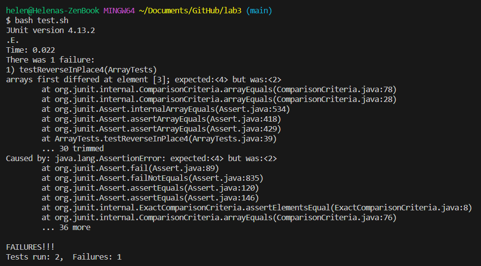
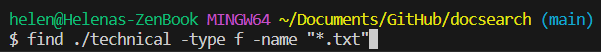
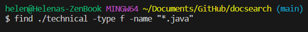
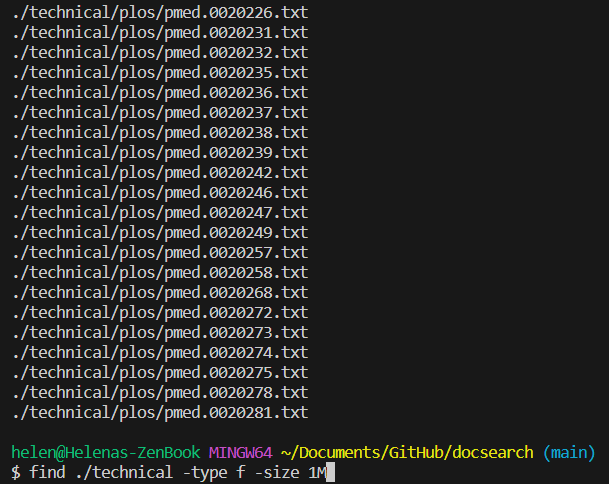
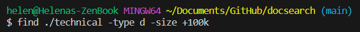
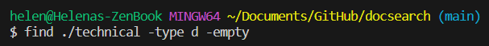
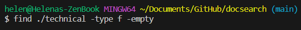
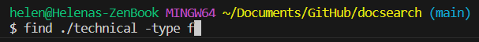
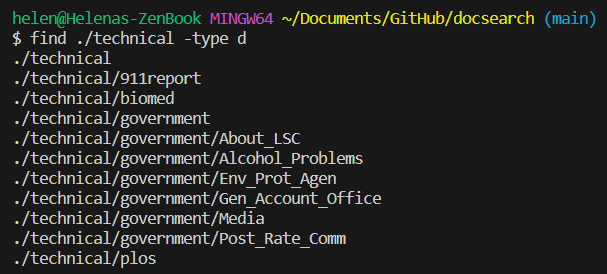

Helena Phamova - **CSE 15L Lab Report 3**

---

**PART 1 - BUGS**

The method with a bug that I chose:
```
  // Returns a *new* array with all the elements of the input array in reversed
  // order
  static int[] reversed(int[] arr) {
    int[] newArray = new int[arr.length];
    for(int i = 0; i < arr.length - 1; i += 1) {
      arr[i] = newArray[arr.length - i - 1];
    }
    return arr;
  }
```

My failure-inducing test input:

```
@Test
  public void testReverseInPlace4(){
    int[] input3 = {5, 4, 3, 2, 1};
    ArrayExamples.reverseInPlace(input3);
    assertArrayEquals(new int[] {1, 2, 3, 4, 5}, input3);
  }
```


 
My non-failure-inducing input:

```
@Test
  public void testReverseInPlace5(){
    int[] input3 = {5};
    ArrayExamples.reverseInPlace(input3);
    assertArrayEquals(new int[] {5}, input3);
  }
```

The symptom, as the output of running the tests:



**CODE CHANGE**

Before:

```
  static void reverseInPlace(int[] arr) {
    for(int i = 0; i < arr.length; i += 1) {
      arr[i] = arr[arr.length - i - 1];
    }
  }

```

After:

```
  static int[] reversed(int[] arr) {
    int[] newArray = new int[arr.length];
    for(int i = 0; i < arr.length - 1; i += 1) {
      arr[i] = newArray[arr.length - i - 1];
    }
    return arr;
  }
```

The issue:
```
The bug essentially results in a half-reversed array because the
code moves the index numbers of the second half of the array to
the beginning but fails to reverse the other half.
```

---

**PART 2 - RESEARCHING COMMANDS**

The command that I chose to research is ``FIND``

1. ``find . -type f -name "*.txt"`` [searching by file type]




This command is most useful for the user to filter out specific file types.

2. ``find . -type f -size +1M`` [search by file size]




This command can help find out which files take up a lot of storage and aids the user with storage management.

3. ``find . -type f -empty`` [search for empty files or directories]




This command helps with finding out any empty files or directories that might be redundant.

4. ``find . -type d`` [search for directories/files only]




This command can be useful to find out all the files or directories that are in the repository that help with project management.

---

**WORKS CITED**

ChatGPT 

Prompts entered: 
``find 4 interesting command-line options or alternate ways to use the command 'find'``

``can you come up with other 4 ways``

``other 4 ones please``

I chose the ones I liked the most and began experimenting with the commands.


