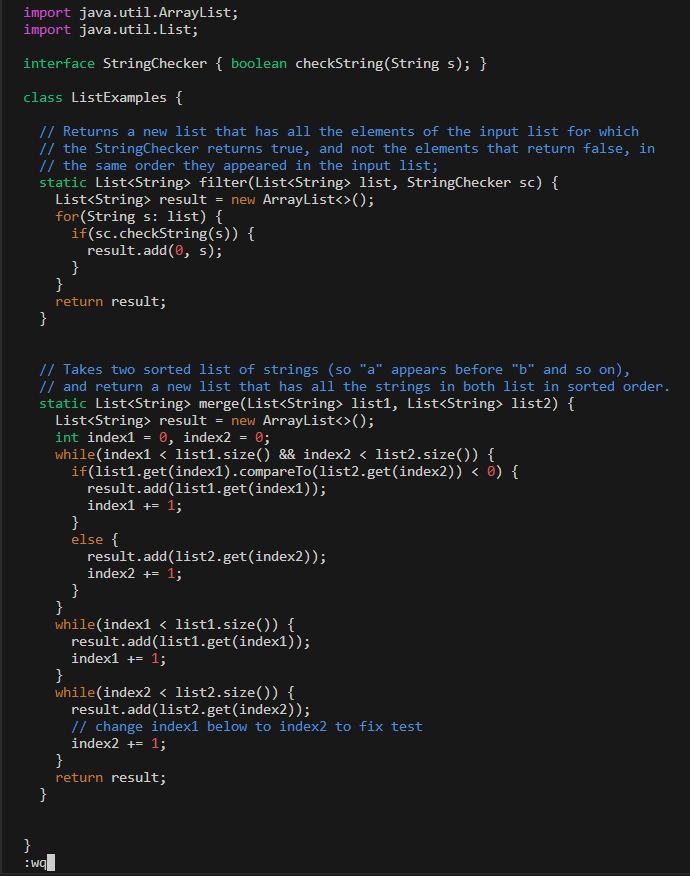
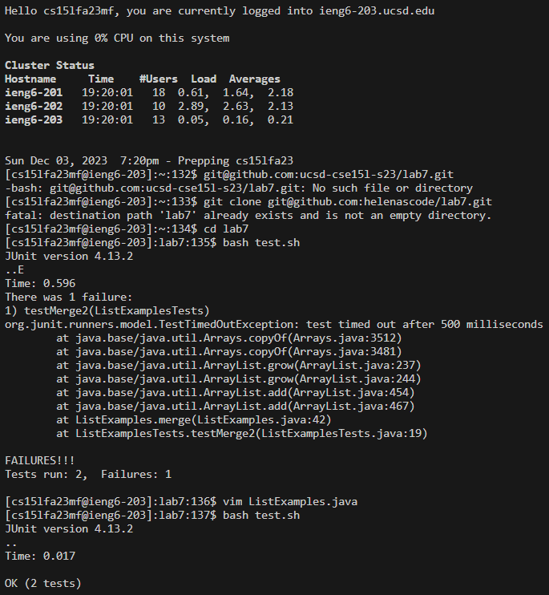

Helena Phamova - **CSE 15L Lab Report 4**

---

Forking Lab 7

```
Go to the link and click on the 'fork' button
```

```
https://github.com/ucsd-cse15l-s23/lab7
```


SSH URL

After done forking, click on '<> code' button where you select 'SSH' clone URL:

```
git@github.com:helenascode/lab7.git
```

ieng6

```
<ctrl> <v> ssh cs15lfa23mf@ieng6.ucsd.edu <enter>
```

```
git clone git@github.com:helenascode/lab7.git <enter>
```

running tests

```
cd lab7 <enter>
```

```
bash test.sh <enter>
```

```
JUnit version 4.13.2
..E
Time: 0.596
There was 1 failure:
1) testMerge2(ListExamplesTests)
org.junit.runners.model.TestTimedOutException: test timed out after 500 milliseconds
        at java.base/java.util.Arrays.copyOf(Arrays.java:3512)
        at java.base/java.util.Arrays.copyOf(Arrays.java:3481)
        at java.base/java.util.ArrayList.grow(ArrayList.java:237)
        at java.base/java.util.ArrayList.grow(ArrayList.java:244)
        at java.base/java.util.ArrayList.add(ArrayList.java:454)
        at java.base/java.util.ArrayList.add(ArrayList.java:467)
        at ListExamples.merge(ListExamples.java:42)
        at ListExamplesTests.testMerge2(ListExamplesTests.java:19)

FAILURES!!!
```

debugging

```
vim ListExamples.java <enter>
```

```
//navigating around the file
<h> left
<j> down
<k> up
<l> right
```

```
//editing the file to debug
43 <j>
<e>
<x>
<i>
2
<ESC>
:wq
```



run test again

```
bash test.sh <enter>
```

```
JUnit version 4.13.2
..
Time: 0.017

OK (2 tests)
```



```
git add ListExamples.java <enter>
```

```
git commit -m "fixed bug" <enter>
```

```
git push <enter>
```

**the end**

time elapsed: 1:12:02


