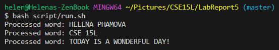

Helena Phamova - **CSE 15L Lab Report 5**

---

**PART 1**

---
@MelanieTheCoder

**A buggy method - please help!**

Hi everyone! I'm currently working on a method that seems to have some bugs but I can't seem to figure out what it is. I would really appreciate it if anyone could help me out and point me towards the right direction. Currently struggling to manage a java file and a bash script, everytime I run the bash script, it says that the system cannot find the path of data/input.txt, which in this case, I believe I wrote out the path correctly. This is what I have:


---

@TAforCSE15L

Hi Melanie, 
you are definitely on the right track as to knowing what the bug is about. The error message is telling you to look at line 8 in the Main.java file, so I think you should take a look at it again and perhaps double check if you put the path in correctly. Think about your working directory and what you are trying to do right now - run a specific file in that project. In this case, the 'ls' and 'cd' commands will be your best friends! Best of luck and let me know how your debugging goes!

---

@MelanieTheCoder

Thank you, @TAforCSE15L ! You were completely right. I realized that since the Main.java file is in the 'src' directory, I needed to give it a path begins from the home directory that goes down to input.txt, which is located in a different directory. This highlights the importance of providing absolute paths when trying to retrieve or utilize a specific file within a coding project so prevent any confusion. 



---

File and Directory Structure of the Project:

```
- src
  - Main.java
- data
  - input.txt
- scripts
  - process.sh
```

---

**Contents BEFORE debugging:**

Main.java

```
import java.io.BufferedReader;
import java.io.FileReader;
import java.io.IOException;

public class Main {
    public static void main(String[] args) {
        try {
            BufferedReader br = new BufferedReader(new FileReader("data/input.txt"));  
            String line;

            while ((line = br.readLine()) != null) {
                processWord(line);
            }

            br.close();
        } catch (IOException e) {
            e.printStackTrace();
        }
    }

    // Helper method for processing each word
    private static void processWord(String word) {
        System.out.println("Processed word: " + word.toUpperCase());
    }
}
```

run.sh

```
#!/bin/bash

cd C:Users/helen/Pictures/CSE15L/LabReport5/src

javac Main.java
java Main
```

input.txt

```
Helena Phamova
CSE 15L
Today is a wonderful day!
```

Command line to trigger the bug:

```
$ bash script/run.sh
```

The bug:

```
BufferedReader br = new BufferedReader(new FileReader("data/input.txt"));
```

```
BufferedReader br = new BufferedReader(new FileReader("../data/input.txt"));
```


---

**PART 2**

For the second half of the quarter, I learned a lot of technical things using the terminal. I learned new command lines and vim which was cool. In general, I believe the layout of the class really helped me understand the concepts of files and directories, and it made me become a better coder in general now that I am familiar with the technicalities of the "behind-the-scenes" of programming. The labs definitely fostered my learning curve in handling software tools and shortcuts that makes my life a little better when coding.
