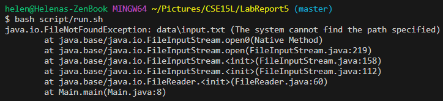
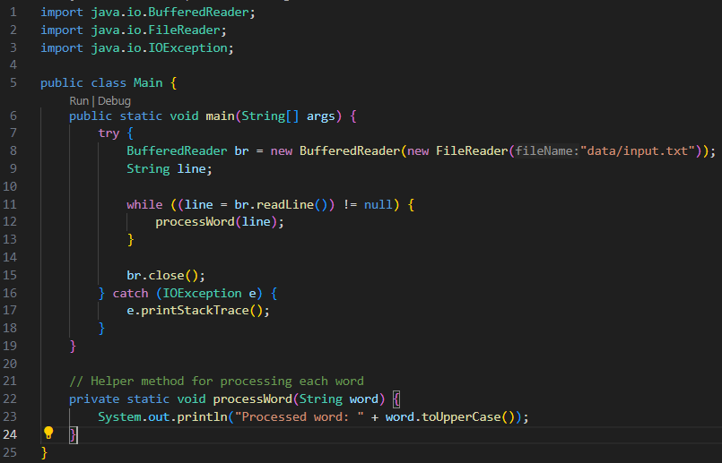

Helena Phamova - **CSE 15L Lab Report 5**

---

**PART 1**

Debugging scenario, design it like an edstem conversation with screenshots

```
**A buggy method - please help!**

Hi everyone! I'm currently working on a method that seems to have some bugs but I can't seem to figure out what it is. I would really appreciate it if anyone could help me out and point me towards the right direction. Currently struggling to manage a java file and a bash script, everytime I run the bash script, it says that the system cannot find the path of data/input.txt, which in this case, I believe I wrote out the path correctly. This is what I have:
```




```
Hi Melanie, 
```


---

**PART 2**

For the second half of the quarter, I learned a lot of technical things using the terminal. I learned new command lines and vim which was cool. In general, I believe the layout of the class really helped me understand the concepts of files and directories, and it made me become a better coder in general now that I am familiar with the technicalities of the "behind-the-scenes" of programming. The labs definitely fostered my learning curve in handling software tools and shortcuts that makes my life a little better when coding.
